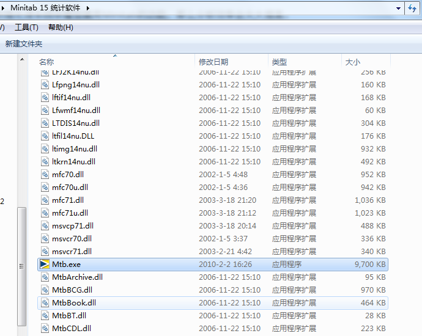
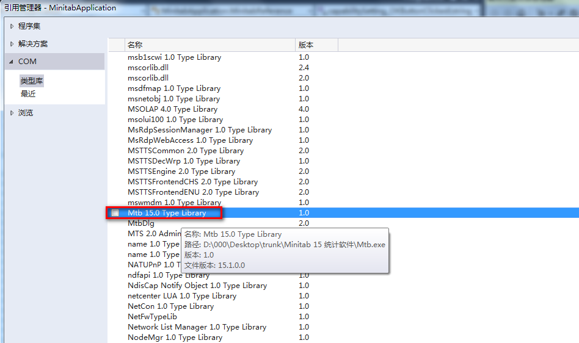
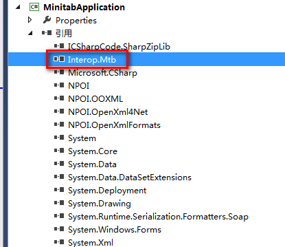
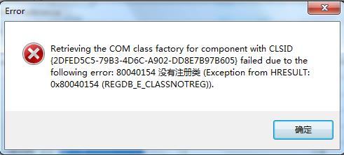

# MinitabApplication

A C# program to call a statistic software whose name is Minitab

## Minitab

Minitab 是一款强大的质量管理统计软件，其包罗万象的强大统计功能和简易的可视化深受广大质量管理工作者喜爱。尤其在制造业领域中，对各工艺参数以及产品特性参数的质量分析的帮助是相当大的。

在大型智能制造业工厂中，每天都会产生巨量的工艺参数 和质量参数数据。而在对这些数据分析的过程中，只能以复制粘贴数据的形式在Minitab软件中进行使用。这种接入方式对于巨量数据的操作相对繁琐，效率低下。如果能够在工厂本身的数据处理系统中增加调用Minitab的功能，那么分析效率会大大提高。

[Minitab官方](http://support.minitab.com/zh-cn/minitab/18/macro-library/macro-help/automate-and-customize-minitab-with-programming-com/)以及[buxiaoyang](https://github.com/buxiaoyang/MinitabAutomation) 介绍了一种调用Minitab程序的com组件库自动化生成报表的方法。在参考他的demo之后，我自己也做了一个demo。可以打开本地excel文档，读取数据到Minitab中，自动生成SPC X-R / X-S控制图和正态分布能力分析图，并将结果展现在demo中。

#### 1.Minitab  com类型库引用

电脑里需装有Minitab软件，并正常打开使用。我使用的是15.0的软件。







#### 2.调用Minitab的核心命令


- 由动态图可以看到，要生成X-R图及结果数据，需以下两条命令

```matlab

MTB > Name C13 "平均值1" C14 "标准差1" C15 "绘制的点1" C16 "绘制的点2" C17 "中心线值1" C18 "中心线值2" &
CONT>     C19 "控制限制值1" C20 "控制限制值2" C21 "控制限制值3" C22 "控制限制值4" C23 "子组大小1" C24 "检验结果1" &
CONT>     C25 "检验结果2" C26 "检验结果3" C27 "检验结果4" C28 "检验结果5" C29 "检验结果6" C30 "检验结果7" &
CONT>     C31 "检验结果8" C32 "检验结果9" C33 "检验结果10" C34 "检验结果11" C35 "检验结果12".
MTB > XRChart;
SUBC>   RSub '1' - '10';
SUBC>   Test 1 2 3 4 5 6 7 8;
SUBC>   Location '平均值1';
SUBC>   Variation '标准差1';
SUBC>   PPoints '绘制的点1' - '绘制的点2';
SUBC>   CenLine '中心线值1' - '中心线值2';
SUBC>   ConLimits '控制限制值1' - '控制限制值4';
SUBC>   SampSize '子组大小1';
SUBC>   TResults '检验结果1' - '检验结果12'.
```


- 正态能力分析的命令同样是两条。如下，一条是命名变量，一条是生成分析结果

```matlab

MTB > Name c13 "LSL1" c14 "目标1" c15 "USL1" c16 "平均值1" c17 "样本N1" &
CONT>      c18 "WStDev1" c19 "OStDev1" c20 "Cp/ZBen1" c21 "CPL或Z.LSL1" &
CONT>      c22 "CPU或Z.USL1" c23 "Cpk1" c24 "Cpm1" c25 "Pp/ZBen1" &
CONT>      c26 "PPL或Z.LSL1" c27 "PPU或Z.USL1" c28 "Ppk1"
MTB > Capa;
SUBC>   Rsub '1'-'10';
SUBC>   Lspec 4;
SUBC>   Uspec 6;
SUBC>   Pooled;
SUBC>   AMR;
SUBC>   UnBiased;
SUBC>   OBiased;
SUBC>   Target 5;
SUBC>   Toler 6;
SUBC>   Within;
SUBC>   Overall;
SUBC>   LSL  'LSL1';
SUBC>   STarget  '目标1';
SUBC>   USL  'USL1';
SUBC>   Mean  '平均值1';
SUBC>   N  '样本N1';
SUBC>   SDT  'WStDev1';
SUBC>   SDO  'OStDev1';
SUBC>   CP  'Cp/ZBen1';
SUBC>   CPL  'CPL或Z.LSL1';
SUBC>   CPU  'CPU或Z.USL1';
SUBC>   CPK  'Cpk1';
SUBC>   CPM  'Cpm1';
SUBC>   PP  'Pp/ZBen1';
SUBC>   PPL  'PPL或Z.LSL1';
SUBC>   PPU  'PPU或Z.USL1';
SUBC>   PPK  'Ppk1';
SUBC>   CStat.
```

#### 3. DEMO效果

最终demo实现的效果如下。


#### 4.异常

使用过程中可能出现的异常，这是因为安装好的Minitab15还没有被Window系统知道已经使用过。需要先确认Minitab15软件是否可以正常打开。



#### 5. 拓展

若此demo的功能集成到某个想要分析数据的系统中，那么文件打开这一功能可以变成某系统的搜索查询数据的功能。查询后的数据就可以使用demo中的控制图或能力指数功能进行分析了。此外，Minitab中还有很多特别强大的质量分析功能，可参照2中获取到核心命令，再把核心命令集成模块程序在系统用户界面上操作。
